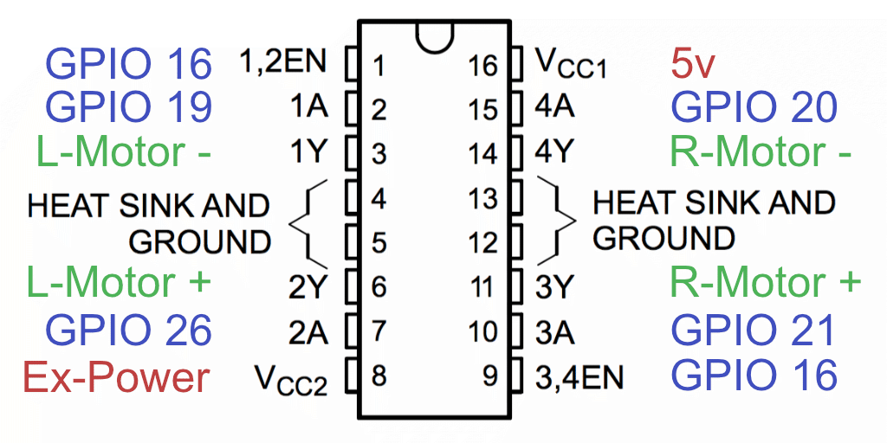

Pi Tank
======
Raspberry Pi Tank, play with 🎮 PS DualShock 2 or scripts.

[📺 Demo On Youtube](https://youtu.be/czwEzWJb0UM)

# Usage

## Install:

```
# npm install pi-tank
```

## Create run.js file:

```
var PiTank = require('pi-tank');
tank = PiTank();

tank.play([
    {
        play: function () {
            tank.break();
        }
    },
    {
        play: function () {
            tank.speed(100);
        },
        time: 3000
    },
    {
        play: function () {
            tank.direction(90);
        },
        time: 3000
    },
    {
        play: function () {
            tank.direction(0);
        },
        time: 3000
    },
    {
        play: function () {
            tank.direction(-90);
        },
        time: 3000
    },
    {
        play: function () {
            tank.direction(0);
        },
        time: 3000
    },
    {
        play: function () {
            tank.direction(-90);
        },
        time: 3000
    },
    {
        play: function () {
            tank.direction(0);
        },
        time: 3000
    },
    {
        play: function () {
            tank.direction(90);
        },
        time: 3000
    },
    {
        play: function () {
            tank.direction(180);
        },
        time: 6000
    },
    {
        play: function () {
            tank.off();
        }
    }
]);
```

## Run it:

```
# sudo node run.js
```

# L293 default wiring



# License

This project is licensed under the MIT License - see the [LICENSE](LICENSE) file for details
